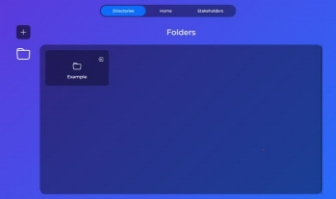
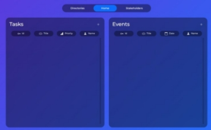
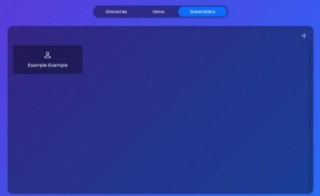
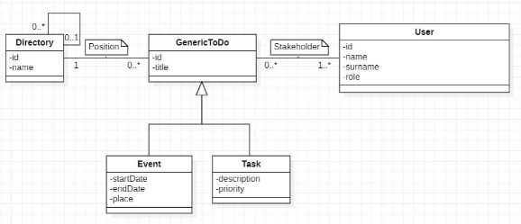
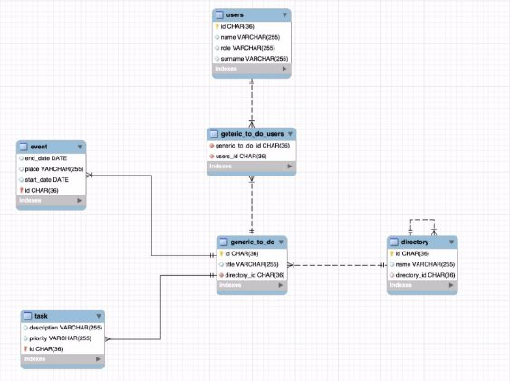

**Introduction to PlaDat** 

**Introduction** 

Nowadays we are overwhelmed with **commitments and tasks to be done**, so much so that, very often, **the greatest risk is to forget some of them.** Over the years, various means have emerged to manage the day in a structured way: from timeless diaries to the most modern digital calendars. The problem, however, according to the PlaDat Team, is that **the latter are often too complex**, so much so that they fail to convince users to abandon paper means. In addition, it is **not obvious to find a web app** that allows to manage, on the one hand, **undated tasks**, i.e., generic reminders and, at the same time, provide **calendaring systems for events**. 

To counteract the problems just listed, PlaDat was born: a **web app that allows to manage, in a simple way:** 

- **Tasks**, i.e., undated reminders (e.g., "do homework," "buy bread," …); 
- **Events**, i.e. scheduled commitments (e.g., "on 15/07/2022 at 9:00 a.m. doctor's visit", …). 

All while enjoying a service through a **user-friendly and customer-oriented interface**. 

**Functionality and implementation details** 

The features made available by this first release of PlaDat are the **main ones for simple and intuitive management of tasks and events**, corresponding, almost one-to-one, with classic CRUD operations: 

- Creating, editing, viewing and deleting stakeholders of tasks and events; 
- Creating, editing, viewing, and deleting events; 
- Creation, editing, viewing and deletion of tasks; 
- Creating, editing, viewing and deleting folders in which to place, in a structured manner, tasks and events; 
- Searching for tasks and events using filters: associated folder, id, title and stakeholder; 
- Managing the connection of events and tasks with their respective folders; 
- Managing the connection of events and tasks with their respective stakeholders. 

**The entities involved** in PlaDat, as can be guessed, are thus 4: 

- **Directories;** 
- **Events;** 
- **Tasks;** 
- **Users.** 

Of which we are interested in managing, respectively: 

- **Directory** 
  - (id: *UUID*) 
  - name: *String*; 
  - directory:Directory. 
- **Event** 
  - (id: *UUID*) 
  - title: *String*; 
  - start\_date: *LocalDateTime*; 
  - end\_date: *LocalDateTime* (optional); 
  - place: *String* (optional); 
  - directory: Directories; 
  - usersList: List<Users>. 
- **Task** 
  - (id: *UUID*) 
  - title: *String*; 
  - description: *String* (optional); 
  - priority: *Priority*; 
  - directory: Directories; 
  - usersList: List<Users>. 
- **User** 
  - (id: *UUID*) 
  - Name: *String*; 
  - Surname: *String*; 
  - Role: *Role* (optional). 

Important to note that the data types of Role and Priority are **Enumerative**: 

- **Role** can take the values: FrontEndDeveloper, BackEndDeveloper, FullStackDeveloper, BusinessManager and ProjectManager; 
- **Role** can take the values: High, Medium and Low. 

**Some PlaDat screenshots and explanation** 

**PlaDat** is divided into **three pages**: 

- **Directories** to manage folders and subfolders associated with To-Dos 

You can **navigate** through the directories (using the buttons to enter the tree of each folder or go back \*folder side icon\*), **edit, add, delete** and **view** them. 

- **Home** to maganage to-dos divided into Events and Tasks 

 

You can **add, edit, delete** and **view** events and tasks. In addition, through the appropriate buttons you can filter them simultaneously and manage **all possible combinations of filters** to provide you with an effective user experience. 

The locations associated with events, moreover, are seamlessly integrated with **Bing Maps** for a support you in selecting locations. 

- **Stakeholders** to manage users associated with to-Dos 

You **can add, edit, delete** and **view** stakeholders. 

Finally, in case of problems we have provided a page for **exceptions** accompanied by a nice little game. 

**Technologies, languages and tools** 

**Universally Unique Identifier (UUID)** 

As can be seen in the previous points, entities in our reality are identified by an id of type **UUID**. The UUID, Universally Unique Identifier, is an **identifier** used in software projects and **standardized** by the Open  Software  Foundation,  created  for  the  purpose  of  enabling  a  distributed  system  to  identify information in the absence of a centralized coordinating system: anyone can create a UUID and use it with **reasonable probability that it will not be used by anyone else**. 

In its canonical form, the UUID is represented by **32 hexadecimal characters** divided into five groups and generally includes a reference to the network address of the host generating the UUID, a timestamp and  an  arbitrary  component.  Given  the  extensive  use  of UUIDs  in  **entreprise  applications**,  a  use confirmed by the internship experiences of group members, despite PlaDat's small size, we preferred to use this type of primary key for our entities while trying to give a more realistic fit to the design.** 

**Version control: Git e GitLab** 

**Version control** helps developers **track and manage changes regarding code** in a software project. **Git**  [(https://git-scm.com/)](https://git-scm.com/)**  is  open-source  distributed  version  control  software,  precisely  the  most widely used in the world, so much so that it is **considered a standard** (*according to a Stack Overflow developer survey, more than 87 percent of developers use Git*). It is critical for collaboration in project development: developers issue their work locally and then synchronize the repository copy with the copy in the server. Making it easier and more efficient for the team to use Git comes into play **GitLab [(https://about.gitlab.com/)](https://about.gitlab.com/)**  a  **hosting  service  for  software  projects**,  a  true  cloud-based implementation of Git. 

Both technologies are used in the development of PlaDat. 

**MVC (Model-View-Controller)** 

Pladat is built around **Model-View-Controller** (MVC), an **architectural pattern**, commonly used for software development, that divides program logic into **three interconnected elements**: 

- The **model** that provides the methods for accessing data useful to the application; 
- The **view** that displays the data contained in the model and handles user interaction; 
- The **controller** receives user commands (usually through the view) and implements them by modifying the state of the other two components. 

**Programming Languages, Frameworks and API** 

In our project we can see the view as a constituent of the **application frontend** (the visible part of a program, the part that the user interacts with), the model and controller as constituents of the **backend** (everything that operates behind the scenes of a web page) and the **database**. 

- The **front-end** founds its basis in the **following languages and frameworks**: 
  - **HTML**  which  is  the  standard  markup  language  for  documents  view  able  by  a  web browser; 
  - **CSS** which is a style sheet language used to describe the presentation of a document based on a markup language such as HTML; 
  - **Javascript** for the dynamic and control part of the front-end of web pages. 
  - **JQuery** which is a library used to extend the functionality of Javascript and simplify its use; 
  - **Thymeleaf**  which  is  a  modern  server-side  Java  template  engine  for  both  web  and standalone  environments,  a  modern-day  HTML5  JVM  web  development.  Thymeleaf stands as a replacement for JSP (JavaServer Pages), a Java web programming technology for  developing  application  presentation  logic,  providing  dynamic  content  in  HTML format; 
  - **Bootstrap** which is a collection of free tools for creating Web sites and applications; 
  - **BING maps** which are BING APIs for auto-completion of places. 
- The **back-end** founds its basis in the **following languages and frameworks**: 
  - **Spring** which is an Open Source web application framework based on Java; 
  - **Java** which is a high-level object-oriented programming language designed to have as few implementation dependencies as possible; 
  - **JPA** (Java Persistence API), is the Java specification that defines how to persist java objects. It is considered as a link between an object-oriented model and a relational database system; 
  - **Hibernate**, is the standard implementation of JPA, a framework that provides an object- relational mapping (ORM) service, that is, it manages the persistence of data on the database by representing and maintaining on relational DBMS a system of Java objects; 
  - **Spring Data JPA** is an abstraction that makes it easier to work with a JPA provider like Hibernate  which  is  used  by  default.  Specifically,  Spring  Data  JPA  provides  a  set  of interfaces for easily creating data access repositories; 
  - **Javax Validation**, an annotation system for expressing entity validation criteria in Java; 
  - **Lombok**, an annotation-based Java library that offers various annotations aimed at replacing Java code that is well known for being boilerplate, repetitive, or tedious to wr 
- The **database** its basis in the following languages and frameworks**:** 
  - **SQL**, a standard relational database language that allows for 360-degree management, creation, editing, and querying; 
  - **H2** which is a relational database manager (DBMS) written in Java language with in memory technology. It can be encapsulated in Java applications or run in client-server mode. This is used for testing. 

**Maven**  was  used,  instead,  for  Java  software  **project  management**  in  terms  of  code  compilation, deployment, documentation, and development team collaboration.  

Furthermore, by way of example, some **integration tests** have been prepared to verify the integration between multiple software components through **Junit**, a unit and integration testing framework for the Java programming language. 

*In PlaDat we used Tymeleaf and, as a result, we tried to limit the use of AJAX and Javascript, but, in some cases, **for efficiency issues we had to compromise**, seeking iteration between the parts (for example, we were able to pass Thymeleaf values to Javascript).* 

**CRUD** 

**CRUD** is an acronym that refers to the **four main operations for manipulating entities in a relational database**: 

- **Create**: creating tables, data, and relationships; 
- **Read**: reading what was created; 
- **Update**: modification, by updating, of what was created; 
- **Delete**: deleting what was created. 

These operations were implemented in our project specifically for **DB management**.  

**API and API Rest interface** 

**APIs** (Application Programming Interface) are a set of **definitions and protocols** by which application software is built and integrated. A **REST API**, on the other hand, is a **programming interface that uses HTTP to handle remote data**. In other words, for most developers, **designing a RESTful API consists of:** 

- **defining web-accessible resources and identifying them with URLs**;
- **mapping CRUD** (Create, Retrieve, Update, Delete) **operations on those resources to HTTP protocol verbs** (Post, Get, Put, Delete).

Due to the fact that almost all devices support HTTP, they can easily work with the REST interface  without  further  implementation.  The  result  is  web  services  that  are  particularly valued  for  a  high  degree  of  platform  **independence,  scalability,  performance, interoperability**, **and flexibility**. For the reasons just mentioned, we decided to use the **REST architecture to implement our platform**, also in anticipation of a possible, future expansion of functionality. 

Because in PlaDat we chose to use **Thymeleaf** to develop the application front-end, the use of **AJAX techniques was kept to a minimum**. However, Thymeleaf **does not support the PUT and DELETE** methods that were mapped to: 

- PUT – POST; 
- DELETE – GET. 

For this reason, we also designed, in this sense, **APIs that were built ad-Hoc** to differentiate HTTP calls: 

- **/** - GET which returns a findAll + front-end view; 
- **/read** – GET which returns a findAll; 
- **/read/{id}** – GET which returns a findById; 
- **/delete/{id}** – GET behaving like a deleteById (ex DELETE); 
- **/create** – POST which create an istance; 
- **/update{id}** – POST behing like an update (ex PUT). 

We **list the APIs of the services offered by PlaDat**: 

||
GET  

**/** 
|
GET 

**/read** 
|
GET 

**/read/{id}** 
|
GET  

**/delete{id}** 
|
POST 

**/create** 
|POST **/update{id}** |
| :- | - | - | - | - | - | :- |
|/stakeholders |Find  all stakeholders and  returns  a view |Find  all stakeholders |Find  a stakeholder by ID |Delete  a stakeholder by  ID  and redirect |Create  a stakeholder and redirect |Update  a stakeholder by  ID  and redirect |
|/events |Find all events and  returns  a view |Find all events |Find  a event by ID |Delete  a event  by  ID and redirect |Create  a event  and redirect |Update  a event  by  ID and redirect |
|/tasks |Find  all  tasks and  returns  a view |Find all tasks |Find  a  task by ID |Delete  a task  by  ID and redirect |Create  a task  and redirect |Update  a task  by  ID and redirect |
|/directories |Find  all directories and  returns  a view |Find  all directories |Find  all directories children  by parent ID |Delete  a directory by ID  and redirect |Create  a directory and redirect |Update  a directory by ID  and redirect |
|/ |Find  all genericToDo (events+tasks) and  returns  a view. |**-** |**-** |**-** |**-** |**-** |

For **events and tasks** there are also searches **with filters**: 

- /tasks/filter/{id}/{title}/{priority}/{user} 

Find all tasks based on some filters (optionals). 

- /events/filter/{id}/{title}/{start\_date}/{user} Find all events based on some filters (optionals). 

Whatever time an address pointing to an **incorrect API is entered**, PlaDat will handle the **exception** by referring back to the **dedicated page**. 

**Organization of the application: the architecture of PlaDat** 

We have already highlighted the technologies used in PlaDat, but we have not emphasized how they affected the **architecture of the project**. ORMs, frameworks, etc. help in writing more maintainable and efficient code, all while decreasing development time; however, they constrain in adhering to certain **proven structures**. 

PlaDat has the following **architecture** at the macroscopic level: 

- In the **front-end** we have: 
  - The **static folder** containing all the static files related to the application front-end (style and scripting files) as well as the web-app images, 
  - The **template folder** with the PlaDat .html pages inside and the **fragments folder**, containing, precisely, the fragments, i.e., parts of code that can be reused in different templates (the heart of Thymeleaf): 
- In the **back-end** we have: 
  - The  **domain  folder**  containing  the  **entities**  that  characterize  our  reality  and  are managed by our ORM and **enumeratives**. Entities are real Java classes that could be migrated into relational database tables thanks to Hibernate. 
  - The **repository folder** containing the **repositories**. Entities don't communicate directly with the DB, except for creating tables, but make use of the corresponding repositories classes. They allow, by importing a specific framework (JPA repositories) to connect Java code to the database, providing, in addition, all the standard methods of querying and manipulating it: find all, find one, save, delete and update, 
  - I  **services**,  or  classes  containing  the  entire  **application  logic**:  the  heart  of  our application. They are composed of: 
    - public methods for communicating with the upper layer (controller); 
    - private (optional) methods for internal functionality. 
  - The  **controller  folder**  containing  the  **APIs**.  The  APIs  are  modules  responsible  for receiving calls from the front-end, extracting the HTTP request information, and passing it to Services. The standard actions that are set up for the APIs are the CRUD operations, which are the four canonical functions for managing data persistence: Create, Read, 

Update, and Delete. From an **MVC perspective** we see: 

- The entire application front-end as **View**; 
- The controller folder containing the APIs as the **Controller** of the MVC; 
- The service, repository and domain folders as **Model**. 

We would like to specify that in order to increase **decoupling** and **separation of concerns**, we have limited front-end logic as much as possible. 

**Domain diagram** 

The **Domain Diagram** is a **structural UML diagram** that describes the various entities that are part of or **relevant at the domain level** and their relationships. It is the most important and classic model of object-oriented analysis, and is useful for **focusing on the fundamental concepts** of a system and defining a specific vocabulary for it. It is not to be confused with the class diagram: we can see it as the source for the (later) creation of software classes. 

**ER diagram (Entity Relationship Diagram)** 

The **Entity-Relationship model** (more commonly called the ER model) is a theoretical model for the **conceptual and graphical representation of data** at a high level of abstraction. It is used when it is necessary to translate the information resulting from the analysis of a given domain into a conceptual schema, called, precisely, an entity-relationship diagram. 

**How to run PlaDat: a short guide** 

Having reached this point we provide a **guide for running PlaDat** locally with attached **installation** of all the necessary tools. 

**Spring Boot applications** such as PlaDat need at least two tools before they can be started correctly. In our case, basic requirements for the application are:  

- **Java 11 or higher**; 
- **Maven**. 

**Java installation** 

*Before proceeding with the installation, it is recommended to disable the Internet firewall. In some cases its default settings reject all unrecognized automatic and/or online installations by default, not allowing Java to be added among the computer software.* 

The **link** for installing Java can be found at the following[ link.](https://www.java.com/en/download/manual.jsp) Important to choose the c**orrect version** based on the minimum guaranteed features of your machine and operating system:  

- Installation on **Windows**. 

In case of Windows operating system, it is necessary to select the appropriate version from the proposals:   

- Choose 32-bit download in case of 32-bit OS, vice versa 64-bit.  

Once you have downloaded the installer, you must start it: a window will appear with the steps to follow. When prompted, you must select the file system path in which to save the Java installation. 

- Installation on **MAC OS**. 

In case of MAC operating system, it is sufficient to install the only version present.   

Once you have downloaded the installer (.pkg), you must start it: a window will appear with the steps to follow.  

To **verify the correct installation** of Java, you can run the command *java -version* in the command prompt. 

**Maven installation** 

The **link** for installing Mavem can be found at the following[ link.](https://maven.apache.org/download.cgi) Also, at the following[ link ](https://maven.apache.org/install.html)is the official Maven installation guide. 

After downloading, in order to **install Maven**, simply unzip the zipper file and add the environment variable *MAVEN\_HOME (MAVEN\_HOME=C:Maven).*  

**Additional detailed guides** for installation on major operating systems can be found at the following links: 

- [Windows;](https://phoenixnap.com/kb/install-maven-windows) 
- [Mac Os.](https://www.digitalocean.com/community/tutorials/install-maven-mac-os)  

**IDE installation *(optional)*** 

After downloading and installing Java and Maven, it is possible, but **not mandatory**, to install an IDE to **facilitate application startup**. Below are the main IDEs, running on both of the above-mentioned operating systems: 

- [Eclipse;](https://www.eclipse.org/downloads/) 
- [Intellij Idea.](https://www.jetbrains.com/idea/download/) 

Afer downloading, both IDEs set up an **installation wizard**.  **Running PlaDat *(command line)*** 

In order to **run PlaDat** from the command line, you need to: 

1. First, locate yourself in the **PATH** of the directory where the ToDoApplication.java file is located; 
2. Run the command *mvn clean compile* (generates the **executable**); 
2. Run the command *mvn spring-boot:run* (starts the **application**). 

**Running PlaDat *(IDE)*** 

In order to **run PlaDat** from the IDE, you need to: 

- Open the IDE and **import** the PlaDat project;  
- Make a right-click on the ToDoApplication.java file, a drop-down menu will appear. In this menu simply  select  the  "*Run  ToDoApplication*"  item  .  The  application  will  be  **compiled**  and  **run** automatically.   

*The IDE, if downloaded for the first time, may need to provide global indications regarding the Java    and/or maven versions in use. If this event occurs, it is necessary to change the build settings in the IDE preferences.* 

**Using/accessing PlaDat** 

In order to use the platform, simply open your browser and type in the address bar ***localhost:8080**.* If the execution procedure was successful, the **home** screen should appear.    

**Using/accessing H2** 

In order to use the H2 DBMS, simply open your browser and type in the address bar ***localhost:8080/h2- console**.* 

**Other information** 

**README, License, Authors e .gitignore** 

To conclude with the analysis present in this report, we would like to highlight the task of **four files present in the project folder** and which have, despite often being underestimated, great importance: README, License, Authors, and .gitignore. 

- **README** is a file that contains information about the files contained in an archive or directory and is commonly included in software packages; 
- **License** is a file that contains the full text of the license chosen for the project without any modifications; 
- **Authors** is a file that identifies who worked on a particular project which critical for copyright management; 
- **.gitignore** is a file in the git system that contains a set of items to be ignored by the version control system. 

**Released version** 

In software development, **version** corresponds to a certain **state in the development of a software**. Conventions for numbering a software version normally involve a triplet of numbers in the form **X.Y.Z**, where X, Y, and Z: 

- **X is the major version**: which should increase only as a result of radical changes in the product, such as those that make it in some way incompatible with its earlier versions; 
- **Y is the minor version**: which increases with the introduction of small features to complement existing ones, but maintaining substantial compatibility; 
- **Z  is  the  patch  version**:  which  augments  usually  only  by  correcting  errors  with  the  same functionality. 

We release the **first version of PlaDat** (v1.0.0).** 

**Useful Links** 

We report **useful links** to PlaDat here: 

- Link a **GitLab** repository [https://gitlab.com/mattiapiazzalunga/2022_assignment3_pladat;](https://gitlab.com/mattiapiazzalunga/2022_assignment3_pladat)  

**LICENSE** 

PlaDat is provided under **GPL-3.0 license.** 

**Team members** 

We report **team members**: 

- Mattia Piazzalunga – 851931 
- Matteo Severgnini – 851920 

*Being a group of two only Back-end or Front-end implementation was required, but to complete the application we implemented both.* 

*In PlaDat we used Tymeleaf and, as a result, we tried to limit the use of AJAX and Javascript, but, in some cases, **for efficiency issues we had to compromise**, seeking iteration between the parts (for example, we were able to pass Thymeleaf values to Javascript).* 

*We really care about the success of this project, so for any problems/understandings, we are available (we provide a contact email:[ m.piazzalunga2@campus.unimib.it)](mailto:m.piazzalunga2@campus.unimib.it).* 

*Main technologies used in PlaDat (visual):* 

     

 +     

  

& (Javax Annotation) --- THE END --- 
Mattia Piazzalunga & Matteo Severgnini  13 
